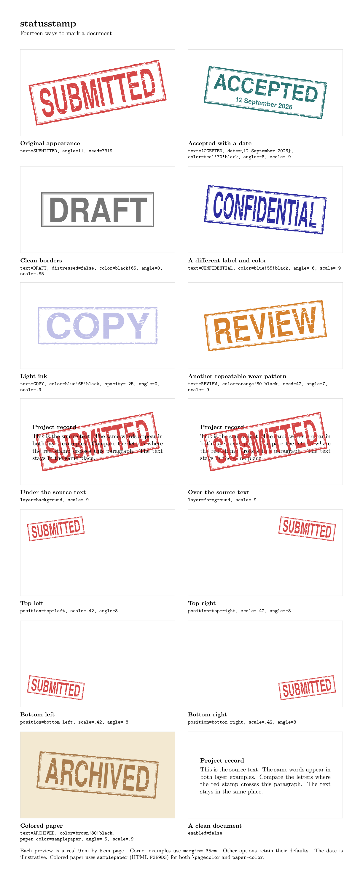

# statusstamp

Distressed, reproducible document status stamps for LaTeX.



[View the full-size example sheet](docs/gallery.pdf) or
[copy the settings from its LaTeX source](examples/gallery-samples.tex).
Each panel is a real miniature page, including the pair comparing
`layer=background` (under the source text) with `layer=foreground` (over it).
Use `pages=all`, `first`, `odd`, or `even` to control which pages receive a stamp.

The default reproduces the original MSI JEPA proposal's **SUBMITTED** stamp:
red ink, a rough double border, heavy TeX Gyre Heros lettering, scratches and
flecks, an 11-degree rotation, and the same fixed wear pattern. It appears
behind the text at the center of every page.

## Use in Overleaf

1. Upload [`statusstamp.sty`](statusstamp.sty) into the same directory as your
   main `.tex` file, or upload the ZIP produced by `make bundle` as a new project.
2. Add this line to your preamble:

   ```latex
   \usepackage{statusstamp}
   ```

3. Compile normally. No shell escape, external images, or external generator
   is required.

This repository is the distribution source for now; the package is not on CTAN.
Keep the `.sty` file with each project so it retains the version you used.

## Configure the stamp

```latex
\usepackage{statusstamp}
\statusstampsetup{
  text=ACCEPTED,
  date={12 September 2026}, % illustrative, explicit date
  color=teal!70!black,
  scale=.48,
  angle=-8,
  position=top-right,
  margin=1cm,
  pages=first
}
```

Options can also be supplied in `\usepackage[pages=first]{statusstamp}`.
Use `\statusstampsetup` for complex values, especially text containing commas.

| Setting | Default | Meaning |
| --- | --- | --- |
| `text` | `SUBMITTED` | Nonempty stamp label; short uppercase labels suit the original proportions. |
| `date` | empty | Optional short second line. No date is generated automatically. |
| `enabled` | `true` | Enable or disable automatic page stamps. |
| `pages` | `all` | `all`, `first`, `odd`, or `even`, using physical PDF pages. |
| `position` | `center` | `center`, `top-left`, `top-right`, `bottom-left`, or `bottom-right`. |
| `layer` | `background` | `background` behind page content, or `foreground` above it. |
| `color` | `statusstampred` | Any xcolor color or expression; default RGB is 205, 32, 32. |
| `opacity` | `.82` | Ink opacity from 0 to 1; the inner border is proportionally lighter. |
| `angle` | `11` | Counterclockwise rotation in degrees. |
| `scale` | `1` | Positive scale factor for the complete stamp, including border and wear. |
| `distressed` | `true` | Rough borders and missing-ink marks; `false` gives clean double borders. |
| `seed` | `7319` | PGF integer random seed; change it for another repeatable wear pattern. |
| `paper-color` | `white` | Color used to paint scratches and flecks. |
| `margin` | `1cm` | Corner inset from the rotated stamp's bounding box to the paper edge. |
| `xshift` | `0pt` | Additional shift to the right; negative values move left. |
| `yshift` | `0pt` | Additional shift up; negative values move down. |

At `scale=1`, the unrotated outer border is 7.64 cm by 2.30 cm. The label is
fitted to the original 6.8 cm by 1.65 cm lettering area. Supplying a date
reserves a smaller second line inside the same border. Long labels and dates
are best avoided; this is a stamp design, not a general text box.

Page selection is independent of printed page numbers: `pages=first` means
the first physical PDF page, even if the document later restarts numbering.
Blank pages and included PDF pages count when LaTeX ships them out.

To produce a clean document:

```latex
\statusstampsetup{enabled=false}
```

To change settings partway through a document, finish the previous pages
first because LaTeX places stamps when pages are shipped out:

```latex
\clearpage
\statusstampsetup{enabled=false}
```

The package does not interpret a document class's `draft` or `final` option.
Use `enabled` explicitly.

## Inline stamps

The optional argument to `\statusstamp` changes only that individual drawing:

```latex
\usepackage[enabled=false]{statusstamp}
% ... inside the document:
\statusstamp[text=DRAFT,scale=.5,distressed=false]
```

`enabled=false` disables page overlays; explicit inline stamps still render.
Inline stamps occupy ordinary layout space. Automatic page stamps do not
change margins, pagination, or the document's fonts.

## Rendering details

The package uses native LaTeX shipout hooks and TikZ vector drawing. It restores
PGF's random generator state after each stamp, so the wear pattern does not
change unrelated randomized diagrams. It does not load a document class or
change the default sans serif font.

Missing ink is painted using `paper-color`, rather than cut out as transparent
holes. On solid colored paper, set that color explicitly. Over photographs or
other varied backgrounds, use `distressed=false`. A foreground stamp, including
its wear marks, can cover page content. An opaque image can hide a background
stamp; use `layer=foreground` when that is the intended result.

## Requirements and development

- LaTeX dated 2020-10-01 or later.
- TikZ/PGF, xcolor, graphicx, and TeX Gyre Heros fonts (the `qhv` family).
- The regression suite additionally needs Python 3.10+ and PyMuPDF.

These TeX dependencies are included in standard Overleaf TeX Live environments.
For a minimal local TeX installation, install PGF and the TeX Gyre fonts as
well. Tectonic fetches required TeX files on its first compilation.

```sh
python3 -m venv .venv
.venv/bin/python -m pip install -r tests/requirements.txt
make check PYTHON=.venv/bin/python ENGINE=tectonic
make gallery PYTHON=.venv/bin/python ENGINE=tectonic
make bundle PYTHON=.venv/bin/python
```

`ENGINE` can also be `pdflatex`, `xelatex`, or `lualatex`, or an absolute path
to one of those engines. GitHub Actions checks all three TeX Live engines.
The suite compares the default drawing with a frozen extraction of the
original stamp; checks rendering, fonts, text positions, page selection,
corner placement, layering, random state, toggles, and invalid settings; and
compiles each example. Build output stays under `build/`.

`make gallery` compiles the fourteen miniature pages in
[`examples/gallery-samples.tex`](examples/gallery-samples.tex), assembles them
with [`examples/gallery.tex`](examples/gallery.tex), and regenerates the PDFs
and README image in `docs/`. The sheet shows each sample's settings. Its small
pages use a 0.35 cm corner inset; normal documents default to 1 cm. Building
the sheet also requires the Latin Modern fonts (`lmodern`).

To compile only an example from the repository root:

```sh
mkdir -p build
tectonic -Z search-path=. --outdir build examples/minimal.tex
# Or with TeX Live:
pdflatex -output-directory=build examples/minimal.tex
```

`make bundle` creates `build/statusstamp-overleaf.zip` containing the package,
a root `main.tex` example, the other examples, README, changelog, and license.
It does not publish or upload anything.

## Origin and license

Version 0.1.0 extracts the original proposal's `\FinalStamp` / `\FinalWatermark`
implementation. To migrate that document, replace its old stamp definitions
and `\FinalWatermark` activation with `\usepackage{statusstamp}`. No proposal
content or private Overleaf identifiers are included here.

Copyright 2026 Chris McComb. [MIT License](LICENSE).
